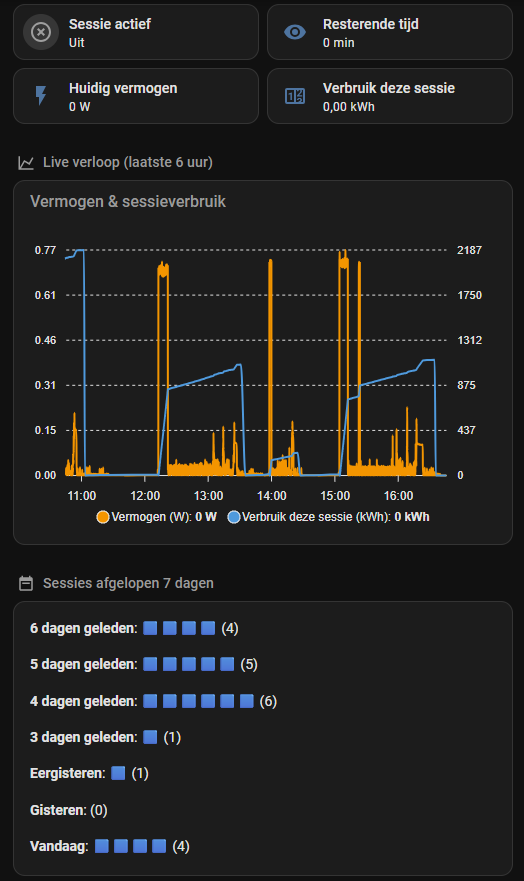
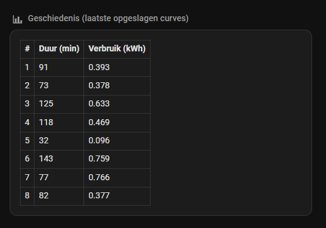
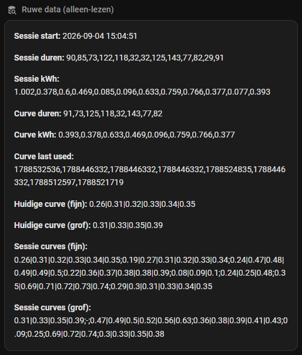

# Device Session Predictor

> Gebouwd voor [Home Assistant](https://www.home-assistant.io/) — dit is een Home Assistant package (YAML), geen losstaande app. Je hebt een werkende Home Assistant-installatie nodig om dit te gebruiken.
>
> *(English version: [README.md](README.md))*

Schat hoe lang een "dom" apparaat (wasmachine, vaatwasser, droger, ...) nog
moet draaien — puur op basis van een vermogenssensor (Watt). Geen slimme
aansluiting op het apparaat zelf nodig, alleen een energiemeter/slimme
stekker die het huidige vermogen rapporteert.

Gebouwd en getest op een wasmachine met een HomeWizard Energy Socket, maar
werkt met elke sensor die een vermogenswaarde in Watt teruggeeft.

**Let op:** de entity-namen in de YAML-bestanden en onderstaande voorbeelden
zijn in het Engels (`device_...`) — dit is bewust gedaan zodat het project
ook voor een internationaal publiek herbruikbaar is. Deze README is puur de
Nederlandse uitleg erbij.

## Hoe het werkt

1. **Sessiedetectie**: vermogen boven een drempel = "aan", onder een andere
   drempel (lager) = "uit". Beide met een minimale aaneengesloten duur, zodat
   korte pieken/dalen tussen programmafases niet per ongeluk als start/einde
   worden gezien.
2. **Checkpoints tijdens de sessie**: cumulatief energieverbruik wordt op
   twee snelheden bijgehouden:
   - **Fijn** (`device_current_curve` / `device_session_curves`): elke 10
     minuten, tot 6x (dekt het eerste uur) — vangt meestal de meest
     onderscheidende fase van een programma (bv. de opwarmfase).
   - **Grof** (`device_current_curve_coarse` / `device_session_curves_coarse`):
     elke 20 minuten, tot 9x (dekt tot 3 uur) — nodig om lange en
     middellange programma's uit elkaar te houden, iets waar de fijne curve
     alleen niet goed in is (die stopt na het eerste uur).

   De fijne en grove curve-lijsten blijven strikt 1-op-1 (één slot per
   opgeslagen curve, zelfde volgorde). Een run die te kort was voor een
   grof checkpoint slaat een letterlijke `-` op als plaatshouder, zodat de
   slot blijft bestaan — de matcher koppelt `curves_coarse[i]` direct aan
   `curves_fine[i]`.
3. **Bij sessie-einde** worden de duur, het energieverbruik en de curve
   opgeslagen: de curve in een schaarse geschiedenis (standaard: 8
   curves), de kale duur/verbruikswaarden in een ruimer logboek
   (laatste 20).
4. **Tijdens een nieuwe sessie** vergelijkt de sensor (`device_remaining_time`)
   de curve-tot-nu-toe met alle opgeslagen curves, en gebruikt de
   dichtstbijzijnde match om de resterende tijd te schatten. De afstand is
   de gemiddelde absolute afwijking per reeks (fijn en grof elk genormaliseerd
   op hun eigen aantal overlappende punten, daarna gemiddeld), zodat een
   curve die op fijn én grof wordt gescoord niet benadeeld wordt tegenover
   een die op minder punten wordt gescoord. Loopt de sessie langer door dan
   de beste match voorspelde (met 5 minuten coulance)? Dan valt de schatting
   terug op de een-na-beste match. De "laatst
   gebruikt"-tijdstempel van de gematchte curve wordt ververst, zodat
   curves waar je echt op leunt niet worden verwijderd (zie punt 6).
   `sensor.device_match_curve` geeft weer welke curve op dit moment de
   beste match is, om op een dashboard te tonen.
5. **Duplicaat-detectie**: een sessie die qua duur (±5 min) én
   energieverbruik (±10%, of ±0,05 kWh absoluut) sterk lijkt op een al
   opgeslagen sessie, wordt niet als nieuwe curve opgeslagen — zo raken de
   beperkte 8 curve-plekken niet gevuld met 8x hetzelfde programma. Bij een
   duplicaat wordt de bestaande curve alleen vervangen als de nieuwe curve
   *vollediger* is (meer checkpoints t.o.v. wat op basis van de duur
   verwacht mocht worden), en wordt de "laatst gebruikt"-tijdstempel
   bijgewerkt.
6. **Verwijderen bij volle opslag**: zodra alle 8 curve-plekken bezet zijn
   en er een écht nieuwe curve binnenkomt, wordt er één plek overschreven
   in plaats van dat de oudste er vanzelf afvalt. De curve met de kortste
   en die met de langste duur worden altijd beschermd (die bepalen de
   spreiding aan programma's die de voorspeller kent); van de rest wordt de
   minst recent gebruikte curve — oudste "laatst gebruikt"-tijdstempel,
   gezet bij aanmaak en ververst bij elke match — verwijderd.

## Bekende beperkingen

- **Eerste paar sessies zijn onnauwkeurig.** Zonder geschiedenis valt de
  schatting terug op een vaste 90 minuten. Pas na een paar sessies met wat
  variatie wordt de curve-matching zinvol.
- **255-tekens-limiet.** De curve-opslag gebruikt `input_text`-helpers
  (HA-limiet: 255 tekens). Dat begrenst hoeveel checkpoints × hoeveel
  sessies je kunt bewaren. De standaardinstellingen (6 fijn + 9 grof, 8
  curves) passen nog, maar met minder marge dan een 6-curve-geschiedenis —
  ga je dit uitbreiden, houd de limiet in de gaten.
- **Programma's zonder duidelijke opwarmfase** (bijv. een koud programma)
  kunnen minder goed te onderscheiden zijn, omdat een groot deel van het
  onderscheidend vermogen van de fijne curve juist uit die opwarm-piek komt.
- **De juiste drempelwaarden vind je zelf.** Er is geen universele
  start/eind-drempel die voor elk apparaat werkt — meet uit wat bij jouw
  apparaat een betrouwbaar signaal is (zie installatie-stap 3 hieronder).

## Bestanden in deze repo

| Bestand | Wat |
|---|---|
| `device_session_predictor.yaml` | **Verplicht.** De kern: sessiedetectie, checkpoints, curve-matching, resterende-tijd-sensor. |
| `device_ready_notification.yaml` | **Optioneel.** Een herbruikbaar `device_ready_signal`-script (push-melding + tijdelijk lamp-signaal, met daarna een deterministisch herstel) plus een klein automation-blokje dat het bij sessie-einde aanroept. |
| `dashboard-card.yaml` | Compacte Mushroom-kaart (vermogen + resterende tijd) die doorklikt naar de detail-subview. |
| `dashboard-subview.yaml` | Volledige detail-subview: status, live-grafiek, sessies per dag, curve-geschiedenis, ruwe data. |

---

## Installatie — optie A: als package (aanbevolen)

Een *package* is één YAML-bestand waarin helpers, automations en sensoren
samen staan, in plaats van los via de UI aangemaakt te worden. Dat maakt dit
project "kopieer, vul een paar regels in, herstart" in plaats van tientallen
losse UI-stappen.

### Stap 1 — Zorg dat Home Assistant packages laadt

Check of je `configuration.yaml` dit al bevat (vaak standaard aanwezig):

```yaml
homeassistant:
  packages: !include_dir_named packages
```

Zo niet, voeg het toe. Maak (als die nog niet bestaat) een map `packages/`
aan naast je `configuration.yaml`.

### Stap 2 — Kopieer het hoofdbestand

Zet `device_session_predictor.yaml` in jouw `config/packages/`-map.

### Stap 3 — Vul de placeholders in

Open het bestand en zoek naar `FILL_IN` en `ADJUST` — dit moet je in ieder
geval doen:

1. **Je vermogenssensor**: vervang elke `sensor.FILL_IN_YOUR_POWER_SENSOR`
   door de entity_id van jouw sensor die het huidige vermogen in Watt geeft.
2. **Start-drempel**: de `above:`-waarde in de eerste automation — hoeveel
   Watt duidt betrouwbaar op "er draait een programma" (niet op standby of
   menu-navigatie)?
3. **Start-duur** (`for:`): hoe lang moet dat aaneengesloten aanhouden voor
   je het als een echte start vertrouwt?
4. **Eind-drempel**: de `below:`-waarde in de tweede automation — idealiter
   zo dicht mogelijk bij het werkelijke "stil" niveau van je apparaat. Hoe
   dichter bij het echte nulpunt, hoe kleiner de kans dat een pauze tussen
   programmafases onterecht als "klaar" wordt gezien.
5. **Eind-duur** (`for:`): hoe lang moet dat aaneengesloten aanhouden?

**Tip om de drempels te vinden**: bekijk een tijdje de geschiedenisgrafiek
van je vermogenssensor tijdens een volledig programma. Let op:
- Hoe hoog het vermogen tijdens de "echt actieve" fases minimaal is (dat
  wordt je start-drempel).
- Hoe laag het vermogen tussen fases in kan zakken zonder dat het apparaat
  klaar is (je eind-drempel moet daaronder liggen, en/of de eind-duur moet
  langer zijn dan de langste "gewone" pauze).

De standaardwaarden in het bestand (20W gedurende 30s voor start, 35W
gedurende 2m30s voor einde) zijn de waarden die goed werkten op een echte
wasmachine met een HomeWizard Energy Socket — een redelijk startpunt, maar
check ze alsnog tegen de geschiedenisgrafiek van je eigen apparaat.

### Stap 4 — Herstart Home Assistant

Packages worden het betrouwbaarst geladen met een volledige herstart
(Instellingen → Systeem → Herstarten). "YAML herladen" werkt soms ook, maar
bij een nieuwe package is een herstart veiliger.

### Stap 5 — Controleer

Ga naar Instellingen → Apparaten & diensten → Entiteiten, zoek op "Device"
— je zou alle helpers, de energiesensor en de resterende-tijd-sensor moeten
zien. Ga naar Instellingen → Automatiseringen en controleer dat de twee
nieuwe automations er staan en ingeschakeld zijn.

### Stap 6 (optioneel) — Klaar-melding + lamp

Wil je ook een push-melding (en optioneel een lamp-signaal) zodra een
sessie klaar is? Zet `device_ready_notification.yaml` ook in
`config/packages/` en herstart. Het bestaat uit twee delen:

- Een herbruikbaar **script** (`script.device_ready_signal`) dat het werk
  doet: zet een lamp op een signaalkleur, stuurt de push-melding met een
  Ok-knop, wacht maximaal 20 minuten (of tot je erop tikt, of tot iemand
  de lamp zelf omschakelt), en herstelt de lamp daarna deterministisch —
  ruststand-scene als hij aan hoort te staan, anders uit. Vul hierin je
  signaallamp, notify-service en ruststand-scene in (zoek naar `FILL_IN`
  binnen het `script:`-blok).
- Een klein **automation**-blokje dat bij sessie-einde triggert en het
  script aanroept met de kleur/melding van dit apparaat (zoek naar
  `ADJUST` binnen het `automation:`-blok).

Gebruik je dit voor meer dan één apparaat (wasmachine + droger, ...)? Het
script hoeft maar één keer te bestaan — kopieer per extra apparaat alleen
het automation-blokje, geef het een nieuwe `id`/`alias`, laat de trigger
verwijzen naar de `input_boolean.*_sessie_bezig` van dat apparaat, en geef
het een unieke `ok_action` (zodat de juiste Ok-tik bij de juiste melding
hoort). Verwijder de lamp-stappen in het script als je alleen de melding
wilt.

---

## Installatie — optie B: via de UI (stap voor stap)

Geen zin in packages, of je wilt liever alles via de UI klikken? Dat kan
ook — het kost alleen meer klikwerk. Maak de volgende helpers aan via
**Instellingen → Apparaten & diensten → Helpers → Helper toevoegen**:

| Type | Naam |
|---|---|
| Aan/uit-schakelaar | Device session active |
| Datum en tijd | Device session start |
| Tekstveld (max 255) | Device session durations |
| Tekstveld (max 255) | Device session kwh |
| Tekstveld (max 255) | Device curve durations |
| Tekstveld (max 255) | Device curve kwh |
| Tekstveld (max 255) | Device curve last used |
| Tekstveld (max 255) | Device session curves |
| Tekstveld (max 255) | Device session curves coarse |
| Tekstveld (max 255) | Device current curve |
| Tekstveld (max 255) | Device current curve coarse |
| Teller | Device session counter |

Maak daarnaast aan:
- Een **Integratie-helper** ("Riemann-som") met de naam **"Device energy"**
  (→ `sensor.device_energy`, verderop bij naam gebruikt) en als bron je
  vermogenssensor, eenheid-voorvoegsel "k", eenheid-tijd "h" — dit geeft je
  de cumulatieve kWh.
- Een **Utility Meter-helper** met de naam **"Device energy session"** (→
  `sensor.device_energy_session`) en als bron de zojuist gemaakte
  integratie-sensor, cyclus "geen". Deze exacte namen zijn belangrijk: de
  automations die je verderop plakt verwijzen rechtstreeks naar
  `sensor.device_energy` / `sensor.device_energy_session` (geen
  `FILL_IN`-placeholder), dus een andere naam hier geeft een andere
  entity_id en een gebroken verwijzing.
- Twee **Template-sensoren** met de `value_template`-blokken uit
  `device_session_predictor.yaml`: `device_remaining_time` (de
  schatting) en `device_match_curve` (een kort label van welke opgeslagen
  curve die schatting nu gebruikt, bijv. "Curve #3 · ~125 min · 0.63
  kWh", of "No session" als er niks draait).
- *(Optioneel)* Zeven **History stats-helpers** — type "count", entiteit
  `input_boolean.device_session_active`, gevolgde status `on` — één per
  dag, met het start/eind-venster telkens een dag verder terug. Deze voeden
  een "sessies per dag"-grafiek op je dashboard en worden niet door de
  voorspelling gebruikt. Kopieer de `start:`/`end:`-templates uit de
  `history_stats`-sensoren in `device_session_predictor.yaml`.

Maak vervolgens de twee automations aan via **Instellingen →
Automatiseringen → Automatisering toevoegen → In YAML bewerken**, en plak
daar de inhoud van de bijbehorende `automation:`-items uit het
package-bestand (één automation per keer aanmaken).

Let op: bij deze route moet je zelf overal de entity-namen die je bij de
helpers hebt gekozen, laten overeenkomen met wat er in de automations en de
sensor-template staat (Home Assistant genereert de entity_id meestal
automatisch op basis van de naam die je invoert, bijv. "Device session
active" → `input_boolean.device_session_active`).

### Optioneel: klaar-melding + lamp, via de UI

Ga naar **Instellingen → Automatiseringen en scènes → Scripts → Script
toevoegen → (⋮) → In YAML bewerken**, plak de inhoud van het `script:`-item
(alleen het deel onder `device_ready_signal:`) uit
`device_ready_notification.yaml`, en vul je signaallamp, notify-service en
ruststand-scene in (zoek naar `FILL_IN`). Sla het op als "Device ready
signal" (→ `script.device_ready_signal`).

Maak daarna nog één automation aan, op dezelfde manier als hierboven
(**Instellingen → Automatiseringen → Automatisering toevoegen → In YAML
bewerken**), en plak de inhoud van het `automation:`-item. Deze roept het
script hierboven aan — gebruik je dit voor meer dan één apparaat, dan is
dit het enige deel dat je per apparaat herhaalt (eigen trigger-entiteit,
eigen kleur/melding, en een unieke `ok_action` per apparaat zodat de
juiste Ok-tik bij de juiste melding hoort); het script blijft gedeeld.

---

## Dashboard

Twee bestanden, beide met de hand te plakken (dashboards horen niet bij de
YAML-package):

- **`dashboard-card.yaml`** — een compacte
  [Mushroom](https://github.com/piitaya/lovelace-mushroom)-kaart (vereist
  de Mushroom custom card via HACS) voor je hoofddashboard. Toont het
  vermogen en, tijdens een sessie, de resterende tijd; erop tikken opent
  de detail-subview. Toevoegen via de kaart-editor ("Handmatig" /
  YAML-modus).
- **`dashboard-subview.yaml`** — de volledige subview waar de kaart naar
  linkt: live status (met een "nu gematcht met"-tegel die alleen tijdens
  een sessie verschijnt), een sessie-grafiek, sessies per dag, de
  curve-geschiedenistabel en een ruwe-data-overzicht. Toevoegen als
  nieuwe view via de "raw configuration editor" van je dashboard. De
  "Live progress"-grafiek gebruikt apexcharts-card (HACS); een ingebouwde
  `history-graph` als alternatief staat in de comments. Geef de `path:`
  van de view en de `navigation_path` van de kaart dezelfde waarde.

### Screenshots

De subview in actie bij een wasmachine (entiteiten hier hernoemd naar
`wasmachine_*` — bij jou heten ze zoals jij hebt gekozen):

<table>
<tr><td width="50%">

**Status, live grafiek & sessies per dag**
<br>Vermogen, sessieverbruik, en het aantal sessies per dag over de
laatste 7 dagen.



</td><td width="50%">

**Curve-geschiedenis**
<br>De maximaal 8 opgeslagen duur/verbruik-curves waar de matcher tegen
vergelijkt.



</td></tr>
</table>

**Ruwe data**
<br>De onderliggende helper-waarden (sessiestart, duur/kWh-logs, de
huidige en opgeslagen fijne/grove curves) — handig bij het afstellen van
drempels of het uitpluizen van een match.



---

## Marges en instellingen aanpassen

Alle "magische getallen" zitten met opzet los in het automation-bestand,
met uitleg erbij in de comments:

- Checkpoint-interval en -aantal (fijn/grof)
- Duplicaat-marges (±5 min duur, ±10%/±0,05 kWh)
- Val-terug-coulance (5 minuten voordat wordt overgeschakeld naar de
  een-na-beste match)
- Hoeveel sessies/curves bewaard blijven (standaard 20 voor het kale
  duur/kWh-logboek, 8 voor de curve-plekken)
- Verwijder-strategie voor curves — bescherm de kortste + langste curve,
  verwijder daarna de minst recent gebruikte van de rest (de
  `evict_index`-variabele in de sessie-einde-automation)

Pas deze gerust aan naar wat bij jouw apparaat en gebruik past — er is geen
universeel "juist" getal, dit zijn allemaal vuistregels die tijdens de
ontwikkeling voor een specifieke wasmachine goed bleken te werken.

## Licentie

Doe ermee wat je wilt.
